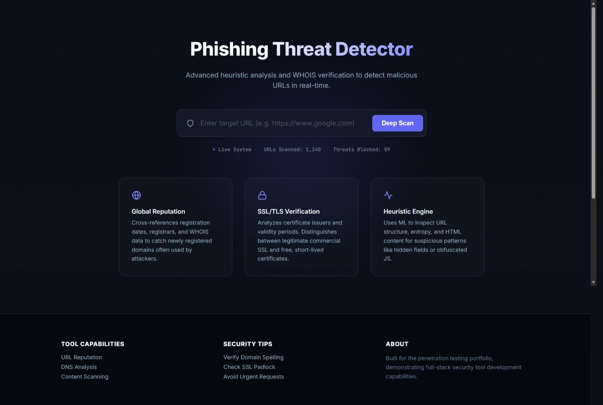

# Phishing Website Detector

A full-stack security tool that detects phishing URLs using a hybrid approach: **Machine Learning heuristics**, **WHOIS domain age verification**, and **SSL certificate analysis**.



## 🛡️ Key Features

- **Hybrid Detection Engine**: Combines URL structure analysis (entropy, length) with real-time domain intelligence.
- **Visual Risk Gauge**: Professional grade circular gauge showing probability of phishing (Safe/Suspicious/Phishing).
- **Threat Indicators**: Clear pass/fail signals for SSL validity, domain age, and suspicious patterns.
- **WHOIS & SSL Analysis**: Automatically fetches domain registration dates and certificate issuers to catch "freshly minted" phishing sites.
- **Batch Scanning with Rate Limiting**: Support for bulk URL analysis via file upload (.txt), protected by a configurable rate limit (customizable in `app/config.py`) to prevent overuse of resources.
- **Cyber-Security UI**: A professional, dark-themed interface designed for security analysts.

## 🛠️ Technology Stack

- **Backend**: Flask (Python)
- **Task Queue**: Celery (with Redis)
- **Database**: MongoDB (for storing scan history)
- **Machine Learning**: Scikit-learn (Random Forest/XGBoost based extraction)
- **Frontend**: HTML5, CSS3 (JetBrains Mono, Inter fonts), Vanilla JS

## 🚀 Installation & Setup

### Prerequisites
- Python 3.8+
- MongoDB (running locally or cloud URI)
- Redis (optional, for async tasks - currently configured to run eagerly for dev)

### Steps

1. **Clone the repository**
   ```bash
   git clone https://github.com/GreenThenics/Phishing-Website-Detector.git
   cd phishing-detector
   ```

2. **Create a virtual environment**
   ```bash
   python -m venv venv
   # Windows
   venv\Scripts\activate
   # Mac/Linux
   source venv/bin/activate
   ```

3. **Install dependencies**
   ```bash
   pip install -r requirements.txt
   ```

4. **Environment Configuration**
   Create a `.env` file in the root directory (optional, defaults provided):
   ```env
   MONGO_URI=mongodb://localhost:27017/phishing_db
   SECRET_KEY=your-super-secret-key
   ```

5. **Run the Application**
   ```bash
   python run.py
   ```
   The application will start at `http://localhost:5000`.


## 🤝 Contributing

Contributions are welcome! Please open an issue or submit a pull request for any features or bug fixes.

## 📜 License

This project is open-source and available under the MIT License.
